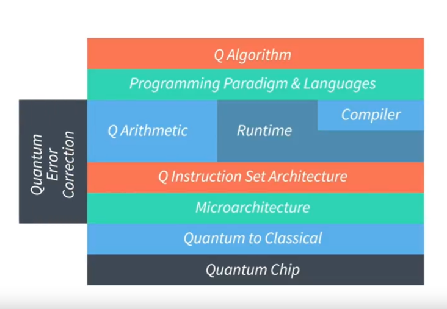
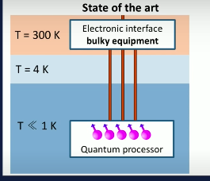
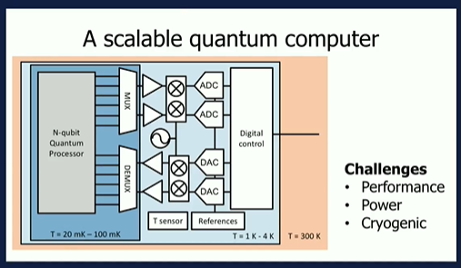

# Build Quantum Computer
[toc]

Opencourse for building quantum computer from TU-Delft

This course has two parts, [part 1](https://ocw.tudelft.nl/courses/building-blocks-quantum-computer-part-1/) for the layer -- qubits and [part 2](https://ocw.tudelft.nl/courses/building-blocks-quantum-computer-part-2/) for other layers to build and operate real quantum computer.

## Part I

## Part II

### Module 1 - Introduction to the building blocks of a quantum computer
structure of quantum computer , path of temperature  and scalability of QC 

Key:
1. Structure of base: two parts, quantum processor and electronic interface which are connected with wires
   Quantum Processor <---(control using pulse) electronic interface
                   --->(measurement using charge sensor)

2. The bottleneck for scalability:
    is the number of wires. Thus they try to move the electronic interface as close as possible to quantum processor.

3. Challenges:
   1. Equipment performance(timing accuracy, tight pulses frequency, stability, read out noise), 
   2. power dissipation(the lower the temperature, the less available the power).
   3. cryogenic technology(electronics that works in the very low temperature)

4. CMOS is the only operator that can work near 30mK temperature with scalability.

Additional reading:
1. [Time line](https://en.wikipedia.org/wiki/Timeline_of_quantum_computing_and_communication) of quantum computing and communication
2. Feynman mentions for the first time the potential of building a quantum computer [ [paper](https://catonmat.net/ftp/simulating-physics-with-computers-richard-feynman.pdf)]
3. Scalable solution for system integration (Cryo-CMOS Circuits and Systems for Quantum
Computing Applications) [ [paper](https://ieeexplore.ieee.org/stamp/stamp.jsp?arnumber=8036394)]
4. [Dilution refrigerator](https://nanoscience.oxinst.com/assets/uploads/NanoScience/Brochures/Principles%20of%20dilution%20refrigeration_Sept15.pdf)  

### Module 2 -- Micro-architecture, compiler and programming languages
1. Qubit Addressing Table, which allows us to keep track of qubits and their location. This table is crucial for accommodating the routing mechanism.
Programming langes list:
   1. [ScaffCC](https://github.com/epiqc/ScaffCC)
   2. [ProjectQ](https://github.com/ProjectQ-Framework/ProjectQ)
   3. [LIQUid](https://github.com/StationQ/Liquid)
   4. [OpenQL](https://github.com/QuTech-Delft/OpenQL)
2. Quantum Compiler (providing part of quantum instruction set):
   1. Decomposition of quantum gates
   2. Optimization of circuits to reduce #qubits or #operations
   3. Schedule the operations to maximize the parallelism of the algorithsm.(reduce latency, build a dependency graph based on ”as soon/late as“ principles)
   4. Map quantum circuit such that chip constraints are satisfied.
   5. Create a Fault-tolerant version of circuit
3. Quantum Compiler list:
   1. ProjectQ from ETH
   2. ScaffCC from Chicago University
   3. Liquid from Microsoft
   4. OpenQL from Qutech(TU-Delft)
### Module 3
1. Phase kickback
   1. given an arbitrary unitary, and one eigenstate as input for the target qubits, then the phase of the component of state of target qubit is transferred to the control qubit, which can then be read out($|0\rightarrow\leftarrow 0|+e^{i\theta_k}|1\rightarrow\leftarrow 1|$ is applied to the control qubit). This trick can also be used to read out the action of an arbitrary large unitary.
### Module 4
### Module 5
### Module 6
